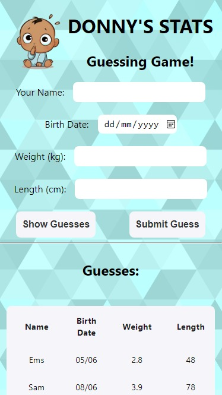

# baby-stats

## A web-based game for guests at our baby shower to guess Donny's stats at his birth!

Built with a React frontend and a flask backend, using an sqlite database. 

### TODO: Write set up instructions for development

Requirements:

- python3
- pip
- venv
- npm/nodejs

Steps:

- Navigate to 'api' directory
- Create a new virtual env with 'python3 -m venv venv'
- Activate the virtual env with 'source venv/bin/activate'
- Install requirements with 'pip3 install -r requirements.txt'

- Navigate to 'client' directory
- Install dependencies with 'npm install'

- Start backend server with 'npm run start-backend'
- Start frontend server with 'npm start' 